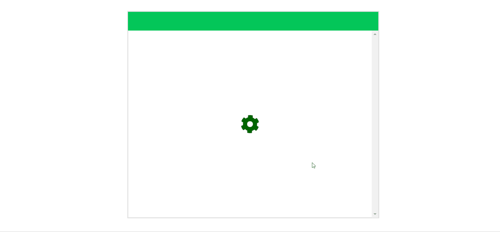

# Welcome to infinite-scroll 👋

> Node.js + Typescript + GraphQL + React를 이용한 cursor based 무한스크롤 구현

### ✨ 구현 모습



### 개발환경

- Typescript
- GraphQL
- Apollo-Client
- React
- styled-component
- Sequelize
- MySQL
- Express
- Git
- Eslint

## Usage

```sh
cd front-end
npm install
npm start

cd ../back-end
npm install
npm start
```

---

_This README was generated with ❤️ by [readme-md-generator](https://github.com/kefranabg/readme-md-generator)_
